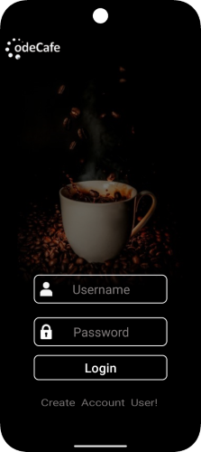

# Современное Android-приложение.

Приложение реализовано с использованием современной архитектуры MVVM, реактивного подхода через StateFlow и интеграции с Firebase.Проект демонстрирует чистую архитектуру и маштабируемость.

## Стек технологий

- **Kotlin** - основной язык разработки
- **MVVM (Model-View-ViewModel)** - архитектура приложения
- **StateFlow** - реактивное управление состоянием
- **LiveData** - наблюдение за состояние UI
- **View Binding** - безопасная работа с элементами интерфейса
- **Firebase Authentication** - авторизация пользователя
- **Firebase Firestore** - облачное хранилище данных
- **Dagger 2 (через Hilt)** - внедрение зависимостей с автоматической генерацией компонентов.(Современный DI-фреймворк с упрощенной конфигурацией)
- **Coroutines** - асинхронная обработка данных и событий
- **JetPack Navigation Component** - управление переходами между экранами через 'NavGraph', 'NavController', 'FragmentContainerView'
- **Lottie Animation** - для оживленности интерфейса главного меню , а также плавности переходов
- **DataStore (Preferences)** - для локального хранения пользовательских настроек и состояния.Обеспечивает асинхронную и безопасную работу с данными
- **JSON + kotlin.serialization** - реализован 'CartRepository' 'FavoritesCart' для хранения данных пользователя.
  *Используется DataStore для локального хранения
  *Данные сериализируются в формате JSON
  *Обновление UI реализовано через 'StateFlow'
  *Поддерживаются операции: сохранение, чтение, очистка.

## Описание проекта

Мобильное Android-приложение, построено на современной архитектуре с акцентом на маштабируемость, читаемость и удобство для пользоватея.
Включает в себя следующие ключевые функции:

- **Авторизация через Firebase Authentication** - безопасный вход с валидацией и обработкой ошибок
- **Firebase Firestore** - для хранения пользовательских данных (UserName) с привязкой к uid
- **Локальное управление корзиной и избранным** - через DataStore + JSON, с реактивным UI
- **StateFlow + LiveData** - гибкое управление состоянием и обновлением интерфейса
- **Чистая архитектура (MVVM)** - разделение слоев, маштабируемость
- **DI через Hilt(Dagger2)** - автоматическая генерация компонентов, упрощенная конфигурация
- **JetPack Navigation** - управление переходами через 'NavGraph' и 'FragmentContainerView'
- **Lottie Animation** - плавные переходы и анимации для улучшения UX
- **Coroutines** - асинхронная работа с данными
- **View Binding** - безопасный доступ к элементам интерфейса.

## Скриншоты

###Экран авторизации
  

###Главный экран
  

###Экран выбора размера и описания кофе
 

###Экран Корзина
 

###Экран Избранное
  

<h3>Экран авторизации</h3>

<h3>Главный экран</h3>

<h3>Экран выбора размера и описания кофе</h3>

<h3>Экран Корзина</h3>

<h3>Экран Избранное</h3>

# Контакты

- **Email** : bulon.danilov1999@mail.ru
- **Telegram** : @jeydanilov
- **GitHub (MyApp)**: https://github.com/Bulkahub/Code-Cafe.git 
