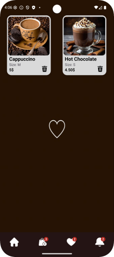

Modern Android Application
The application is built using a modern MVVM architecture, a reactive approach via StateFlow, and Firebase integration. 
The project demonstrates clean architecture and scalability.

Tech Stack:

1.Kotlin – primary development language

2.MVVM (Model-View-ViewModel) – application architecture

3.StateFlow – reactive state management

4.LiveData – UI state observation

5.View Binding – safe interaction with UI elements

6.Firebase Authentication – user authentication

7.Firebase Firestore – cloud data storage

8.Dagger 2 (via Hilt) – dependency injection with automatic component generation (modern DI framework with simplified configuration)

9.Coroutines – asynchronous data and event handling

10.JetPack Navigation Component – screen navigation using NavGraph, NavController, and FragmentContainerView

11.Lottie Animation – adds liveliness to the main menu and smooth transitions

12.DataStore (Preferences) – local storage for user settings and state, ensuring asynchronous and safe data handling

13.JSON + kotlin.serialization – implemented CartRepository and FavoritesCart for user data storage
Uses DataStore for local persistence
Data is serialized in JSON format
UI updates are handled via StateFlow
Supports operations: save, read, clear

Project Description
A mobile Android application built on modern architecture with a focus on scalability, readability, and user convenience. Key features include:

1.Firebase Authentication – secure login with validation and error handling

2.Firebase Firestore – stores user data (UserName) linked to UID

3.Local cart and favorites management – via DataStore + JSON with reactive UI

4.StateFlow + LiveData – flexible state and UI update management

5.Clean architecture (MVVM) – layer separation and scalability

6.DI via Hilt (Dagger2) – automatic component generation and simplified configuration

7.JetPack Navigation – screen transitions using NavGraph and FragmentContainerView

8.Lottie Animation – smooth transitions and animations for enhanced UX

9.Coroutines – asynchronous data handling

10.View Binding – safe access to UI elements

Screenshots

<h3>Login screen.</h3>

<h3>Home screen.</h3>

<h3>Coffee size and description selection screen.</h3>

<h3>Trash Screen.</h3>

<h3>Favorites Screen.</h3>

# Контакты

- **Email** : bulon.danilov1999@mail.ru
- **Telegram** : @jeydanilov
- **GitHub (MyApp)**: https://github.com/Bulkahub/Code-Cafe.git 
